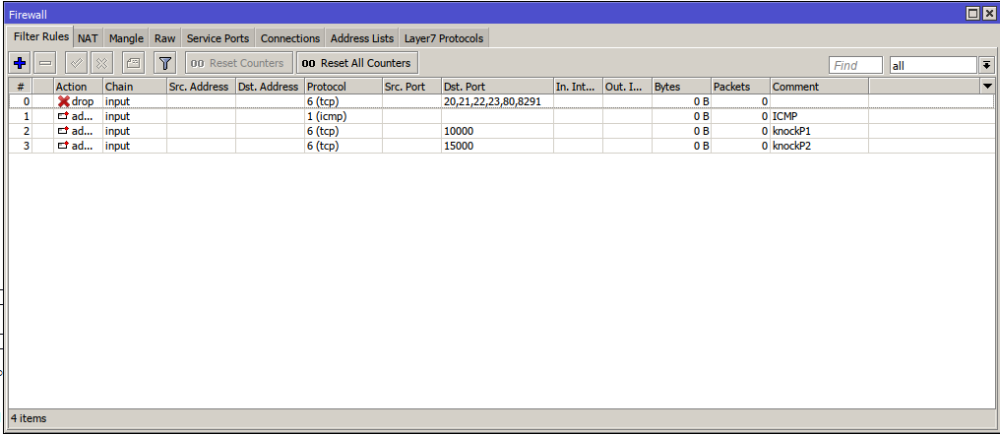

# miknock
Knock secret daily changeable for Mikrotik RouterOS

there are 3 script here , fwknock.rsc , miknock.rsc & knockgen.py
The fwknock.rsc adds the static Firewall rules on your mikrotik for to craete an static IP as Admin address list
(Change it for your desired IP) and also due to it after ping and knock 2 ports the dynamic Admin will be add to 
address list for 1 hour.

you can use miknock.rsc for to scheduler daily change knock port numbers.
Change the Salt , SaltPort and MainPort for to customize the calculation ports.

The final scrip knockgen.py can help you for to create the command that you can use on your PC for knocking the
MIkrotik. Be sure the Salt , SaltPort and MainPort are the same with in the miknock.rsc if you changed , also change
the IP to your Mikrotik IP
